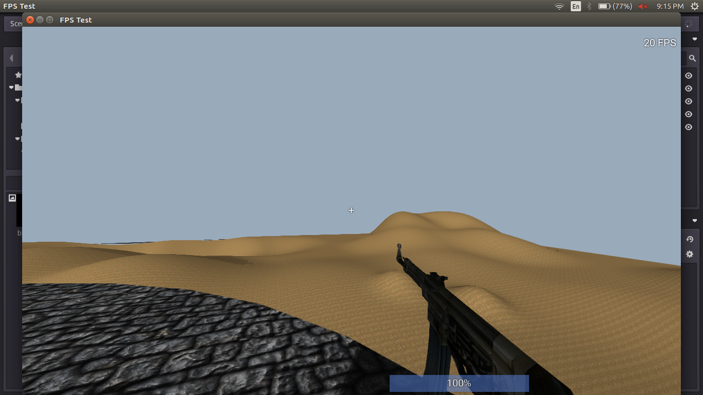

Features
========

- Looking around
- A large map
- Walking/running
- Jumping
- Physics
- Step up stairs and slopes
- View model (first person gun), dynamic toggleable flashlight with shadows

Screenshots
====
  

Keys
====

- Walk: `W/A/S/D` or `Z/Q/S/D`
- Jump: `Space`
- Fire: `Left Mouse Button`
- Run: `Shift`
- Toggle flashlight: `L`

